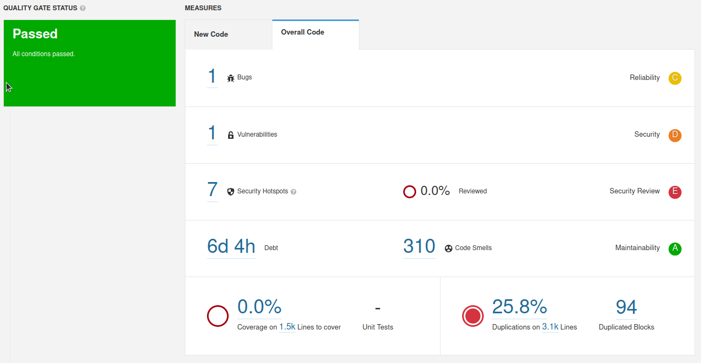
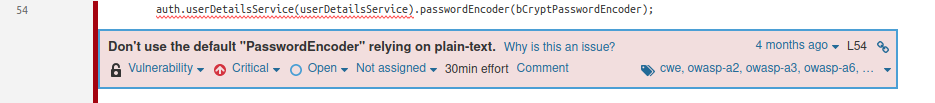

# 1.f/

Issue: Bug     
Problem description: in Dip.java a we create a new Random Object. It's not efficient and may not produce random numbers which is not good.      
How to solve: create a Random Object and reuse this object when we want a new random number

Issue: Vulnerability
0 found

Issue: (major) Code Smell
Problem description: in Dip.java the i variable is being incremented inside the loop body.
How to solve: increment this variable outside the loop body.

Issue: (major) Code Smell
Problem description: in DemoMain.java the print messages are made in the standard output which does not record this messages.
How to solve: use a Logger instead of "System.out"

# 2.a/
Debt: 2h 20min
This value its the time we have to spend to fix all the problems detected by sonar.

# 2.d/
42 Uncovered lines

14 Uncovered conditions

# 3 (This exercise was done by Covinfo19 team: Ricardo Cruz, Diogo Carvalho, Rafael Baptista, Pedro Amaral)

For this exercise we will check last semester work done in IES. 

First thing to do is generate a token to get the project into sonar qube.

Follow the steps in exercise 1.

Token: 4a038b1cc99fe2889f28f158b6b9eb18765df35e

We got this command following the steps of adding a project mannualy

Command to execute: mvn sonar:sonar \
    -Dsonar.projectKey=ies_project \
    -Dsonar.host.url=http://127.0.0.1:9000 \
    -Dsonar.login=4a038b1cc99fe2889f28f158b6b9eb18765df35e

When we head up to localhost:9000 and click on the project we just analyzed we see the following content:

## Bugs
We can see here that we have one bug. 

This bug appears because we used a java library SimpleDateFormat with static. Not all java libraries were written to be thread-safe so this can lead into problems.

## Vulnerabilities
We also have a critical vulnerability

This appears because we are using passwordEncoder in plain-text. Password should be stored in a hash using a secure algorithm preventing brute force attacks, collision attacks as well as adding a salt to lower the risk of rainbow table attacks.

## Other reviews

We can see also that we have got 7 security hotspots that needed to be reviewed to check if there was any risk associated with it.

In this project because it was out of context, it weren't implemented any security hotsots review as well as code review. There isn't any code coverage as well.

The duplication is high, but after reviewed we saw that the major of it was associated with simillar lines but no exactly equal, as well as them having different functionalities so we concluded that this is not 100% accurate and we have to take in consideration that for big projects like this one.

## a) Quality Gates
After all of this was reviewed we defined the following quality gates that we think are recommended to simillar projects.

Briefly explaining them:

On global code:
- Duplicated lines we put an higher percentage than the default because after reviewing the code we saw that the major of duplication was not really duplication but simillar code
- Security rating must be A because that is a critical part of a system
- Coverage must be higher than 60% because the truth is coverage values trend to be low because it is not necessary to run tests in code produced by the IDE. We think 60% is a reasonable value between preventing a lot of code to not be covered and not being necessary to do tests on code that IDE produces.
- Maintanability Rating must be A. We though of this because we got 310 code smells, with some critical and major issues and our rating still get A. This means that getting an A here is not as difficult and it pays off to do good practices in coding.
- Realiability rating must be at least C. This due to in our case we have a bug seen above that is not as critical, and so in other projects similar cases might happen and we don't think its fair not passing just because of a bug like this. 

On new code:
- Critical Issues higher than 10 because using an agile approach we are supposed to do small commits and so if they have got more than 10 issues that might be a problem
- Major Issues higher than 20 the same reason as before, in this case major are not as problematic so we allow some more
- Uncovered Conditions and Lines greater than 25 and 50 respectively due to the major of this problem being associated with automated code the IDE produces, so we allow a values that might be higher than what is expected.

Quality Gates are just metric and all the code must be reviewd. They are a huge help but not the final decision on wether a app is excellent or not.
